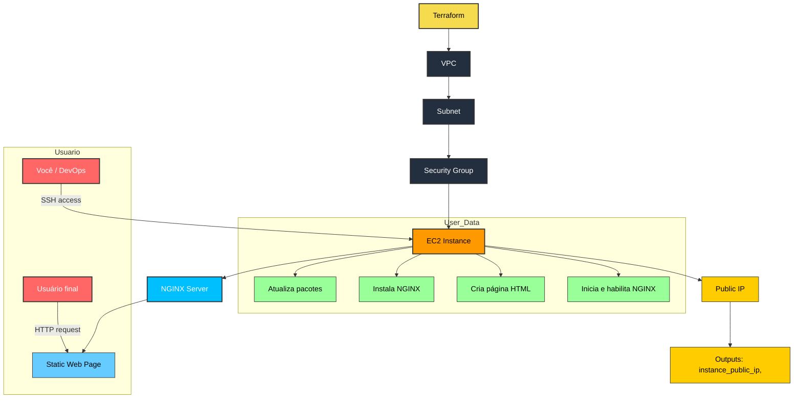

# AWS EC2 Terraform NGINX

Este projeto demonstra como provisionar uma **instância EC2 na AWS** usando **Terraform**, que automaticamente instala e configura o **NGINX** para servir uma página HTML estática.



---

## Estrutura do Repositório

```bash
aws-ec2-terraform-nginx/.  
├── main.tf      # Código Terraform para criar VPC, Security Group e EC2.  
├── variables.tf # Variáveis reutilizáveis.  
├── outputs.tf   # Saídas úteis (ex: IP público da EC2).  
├── user_data.sh # Script executado no boot da EC2 (instala e inicia o NGINX).  
└── README.md    # Documentação do projeto  
└── docs         # Print de imagem  
```

---

## Pré-requisitos

- Terraform instalado (recomendado >= 1.5).  
- Conta na AWS.  
- Credenciais AWS configuradas localmente (via `aws configure` ou variáveis de ambiente):  
  - AWS_ACCESS_KEY_ID  
  - AWS_SECRET_ACCESS_KEY  
  - AWS_DEFAULT_REGION  
- Chave SSH pública disponível (ex.: `~/.ssh/id_rsa.pub`).  

---

## 🚀 Como usar

### 1. Clone o repositório

```bash
git clone https://github.com/seu-usuario/aws-ec2-terraform-nginx.git

cd aws-ec2-terraform-nginx
```

### 2. Inicialize o Terraform

```bash
terraform init
```

### 3. Formate os arquivos .tf, valide e visualize o plano

```bash
terraform fmt
terraform plan
```

### 4. Crie a infraestrutura

```bash
terraform apply -auto-approve
```

Ao final, o Terraform exibirá as saídas com o IP público e DNS da instância.

---

## Acessando a aplicação

Exemplo de saída:

```bash
Outputs:

instance_public_ip = "IP_PUBLICO"
nginx_url = "http://IP_PUBLICO"
```
Aguarde alguns minutos e abra no navegador:

http://<IP_PUBLICO>

Você verá a página com a mensagem:


> **Observação:**  
   Caso queira acessar a instância EC2 via ssh, execute o comando abaixo:

```bash
ssh -i ~/.ssh/id_rsa ec2-user@IP_PUBLICO
```

---

## Destruir a infraestrutura

Para evitar custos, remova todos os recursos criados:

```bash
terraform destroy -auto-approve
```

---

## Exemplo de resultado

Após aplicar o projeto, você verá a página NGINX padrão ou a página personalizada criada pelo `user_data.sh`.  

---

## 📌 Tecnologias utilizadas

- Terraform — Infrastructure as Code.  
- AWS EC2 — Máquina virtual na AWS.  
- NGINX — Servidor web.  
- user_data — Script de inicialização para instalar/configurar o NGINX.  

---

✍️ Autor: [Robson A. Ferreira](https://github.com/devopseasybr)  
